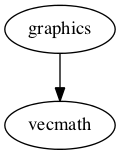

# Graphics   

A library for 2D graphics, written in Rust, that works with multiple back-ends.

Maintainers: @bvssvni

[Documentation](https://docs.rs/piston2d-graphics)

[Getting Started](https://github.com/PistonDevelopers/Piston-Tutorials/tree/master/getting-started)

[How to contribute](https://github.com/PistonDevelopers/piston/blob/master/CONTRIBUTING.md)

| Back-ends |
|--------------------|
| [opengl_graphics](https://github.com/pistondevelopers/opengl_graphics) |
| [gfx_graphics](https://github.com/pistondevelopers/gfx_graphics) |
| [glium_graphics](https://github.com/pistondevelopers/glium_graphics) |

## Motivation

### Sharing graphics source code across projects in Rust

Rust is programming language developed by Mozilla and the Rust community. It is fast, safe, concurrent and cross platform. Because of the many numbers of potential platforms (read: all kinds of computers), it would be nice to have a 2D graphics library that works with multiple back-ends, so you don't have to invent a new graphics engine for each platform you are working on.

### One trait for all back-ends

To write your own back-end, use the `Graphics` trait. The `Graphics` trait implements default behavior for some methods,
which can be overridden for higher quality or better performance.

## Goals

* Easy to use
* Minimal dependencies
* Vector graphics
* Images
* Text
* Clipping
* To have a feature complete library for 2D graphics in general

## Non-Goals

* Image formats
* Backward compatibility (expect lot of breaking)
* Platform or back-end specific code
* 3D
* Physics
* Node tree
* One-to-one correspondence with standards
* Integration with platform GUI
* Resolution detection

## Used by

- [Conrod](https://github.com/pistondevelopers/conrod)

## Dependencies

